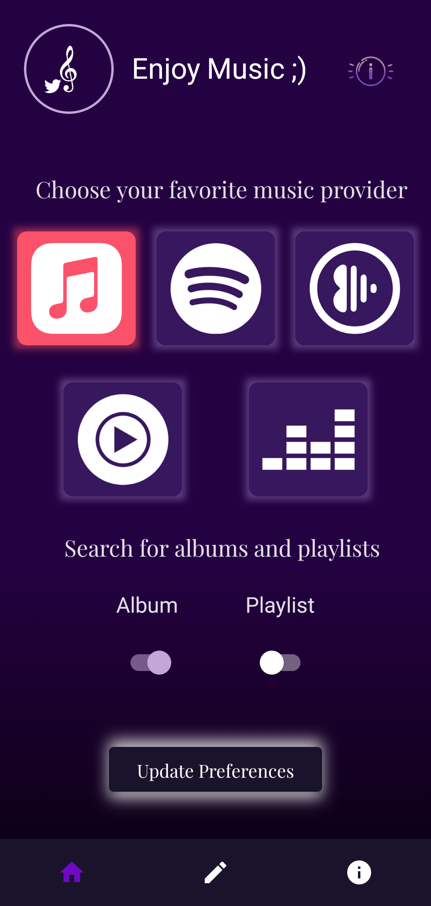
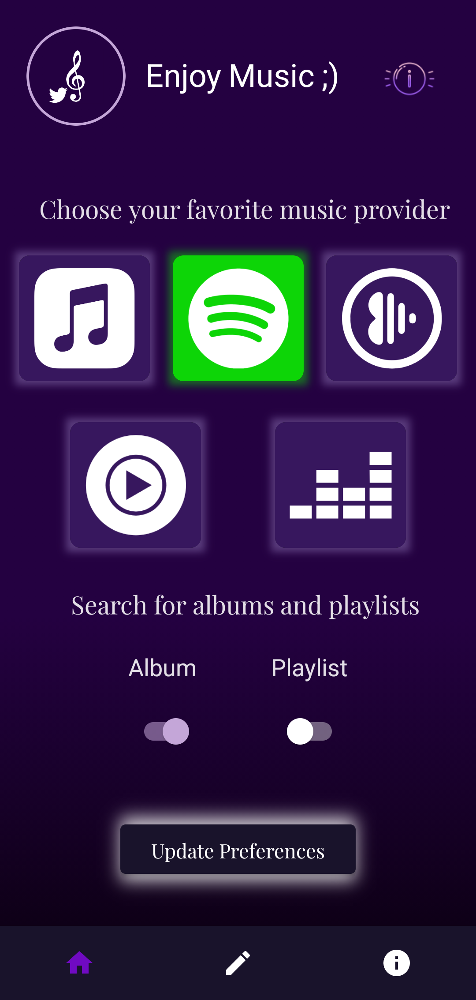

# Music Switcher

### Todo: ~ April 2024

 - Write actual good compose code lol, this project came out when compose was beta and the code is bad
 - Dialog sends you to settings
 - Support Android 12, 13, 14
 - Refactor code

## Avaliable Releases

The Android version works from anywhere. 

Android: Check Github release for APK

The web versions work on Twitter only

Chrome: [Chrome Webstore](https://chrome.google.com/webstore/detail/twitter-music-provider/apkanldijkiplglkhjjajegljppgmgmj)

Firefox: [Mozilla Addons](https://addons.mozilla.org/en-US/firefox/addon/twitter-music-provider/)

# Screen Shots from diffrenet platfroms

Android

 Web Extension (Chrome, FireFox)

# Contribute

Branch into the platform you're gonna work on and this is the global scope of the project
