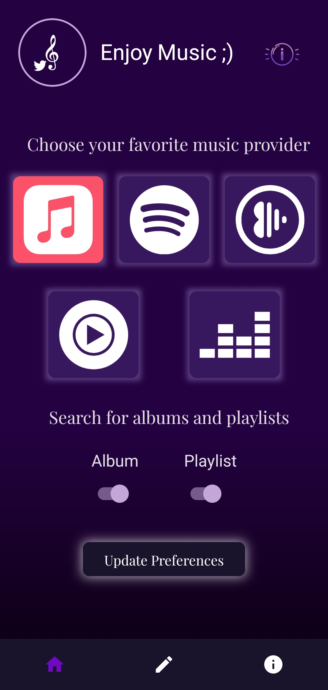
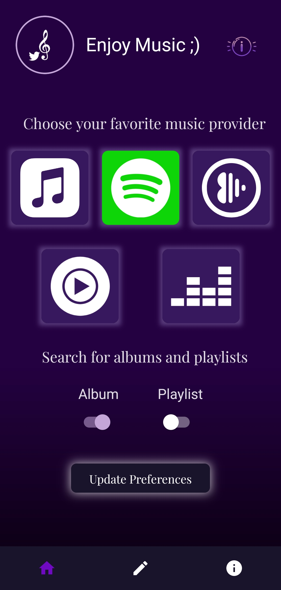
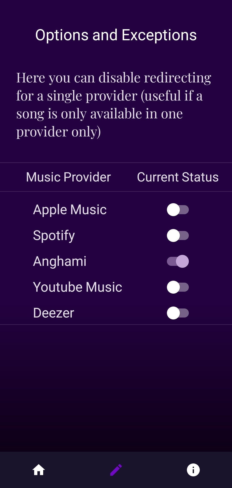
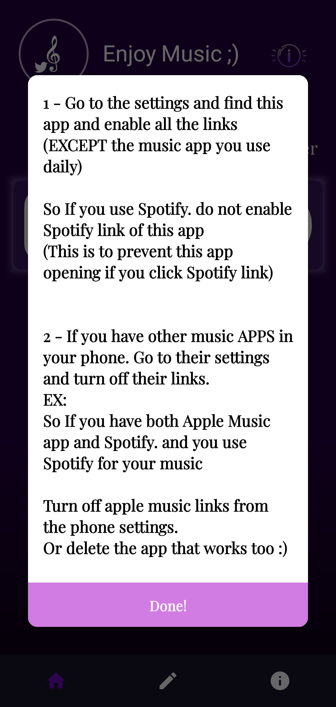

# Music Switcher

# Current Available Release version

The Android version works outside of Twitter as well. 

Android: Check Github release for APK

Chrome: [Chrome Webstore](https://chrome.google.com/webstore/detail/twitter-music-provider/apkanldijkiplglkhjjajegljppgmgmj)

Firefox: [Mozilla Addons](https://addons.mozilla.org/en-US/firefox/addon/twitter-music-provider/)

# Screen Shots from diffrenet platfroms

Android

 Web Extension (Chrome, FireFox)

 

# Contribute

Branch into the platform you're gonna work on and this is the global scope of the project
